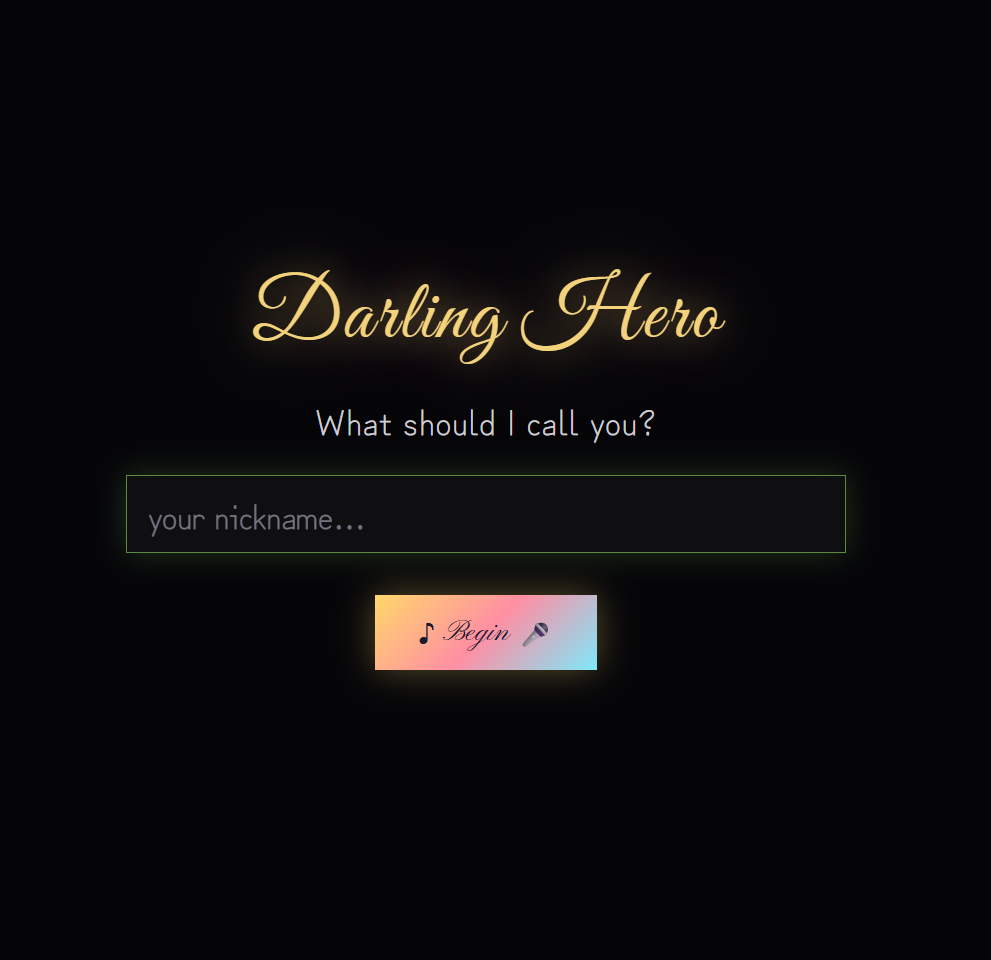
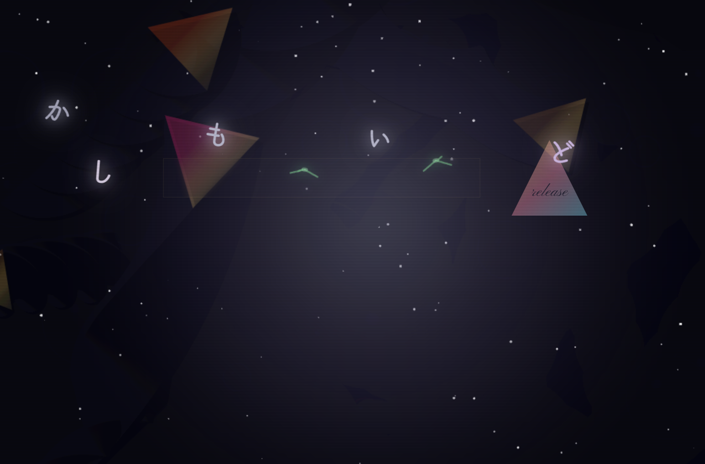
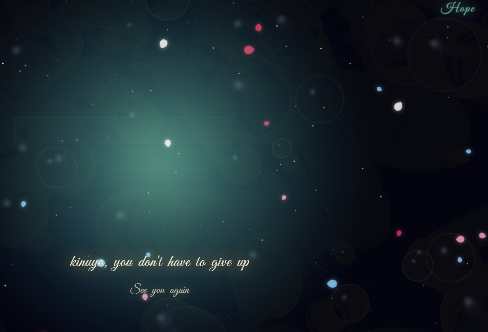
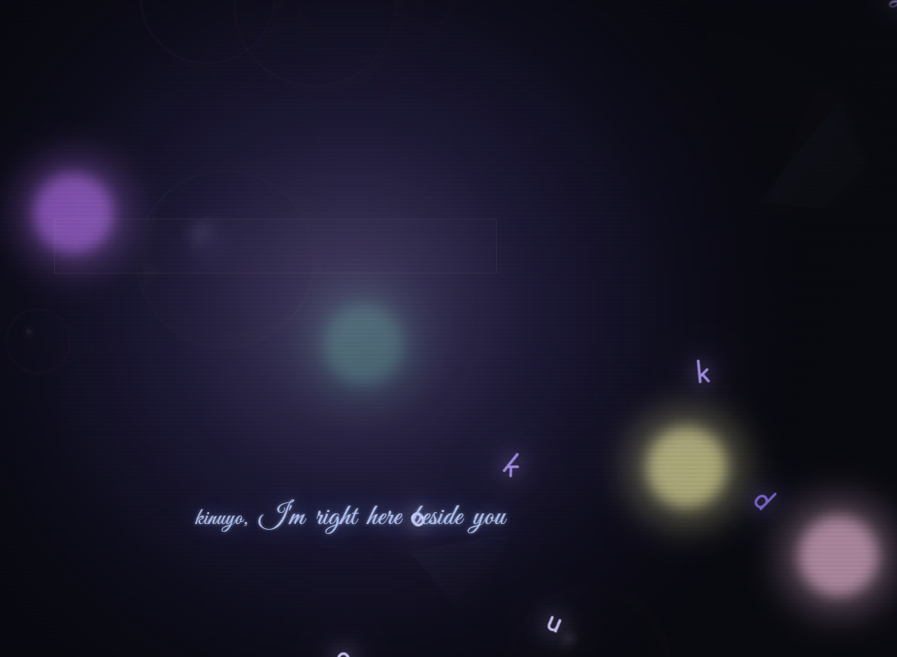

<!-- びっくりマーク！画像1 dargring -->

<!-- びっくりマーク！画像3 sad2 -->

↑　感情を書き出すテキスト記入欄に　淋しい　と書かれた場合、小鳥さんが、あなたの寂しさなど分かち合ってくださいます
苦しさを少しだけ手放してみますか

<!-- びっくりマーク！画像1 modokasii -->

<!-- びっくりマーク！画像1 kibou -->

例えば　孤独を感じておられる場合には、↓のような場面になります。

♪アプリ体験　♫
https://darling-hero.vercel.app

アプリを使っていただいた場合でも　心の寂しさや苦しさはありますよね
そんな時は　あなたの心の奥の愛しい人の名前🩵を呼んでくださいね
心の奥で叫んだ時に、相手に届くといいですね

このアプリでは、入力された名前はあなたの端末の画面に表示されるだけです。サーバーに送信されることも、どこかに保存されることもありません。ページを閉じると、その名前は消えてなくなります。
This app shows the name only on your screen. It is never sent anywhere, never stored, and never seen by anyone else. When you close this page, the name simply disappears.
