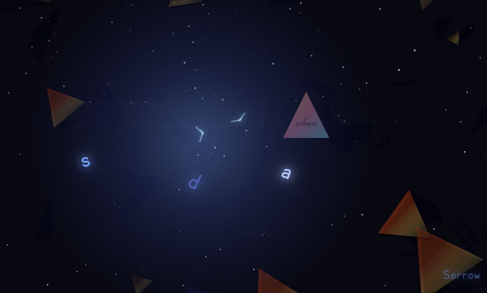
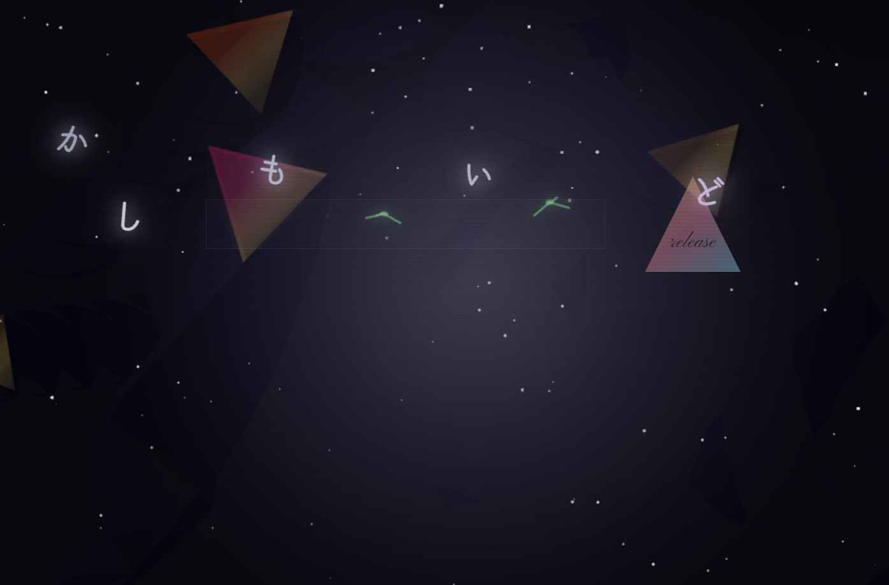
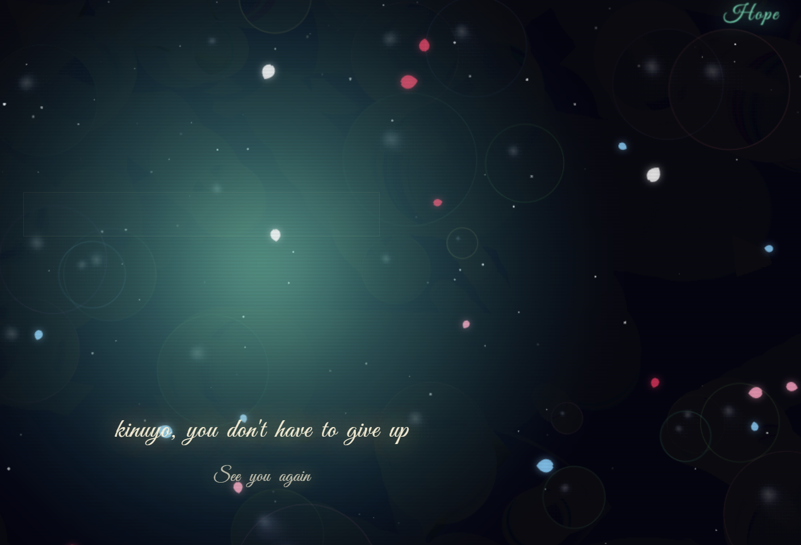
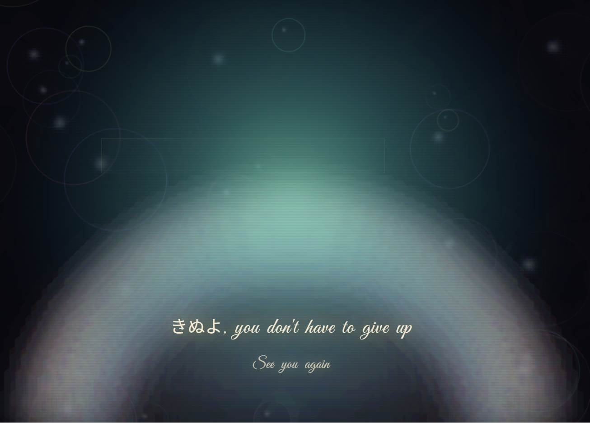

ご自身の言えない感情やモヤモヤした感情を吐き出して頂く簡単な2分あぷりです。

<!-- びっくりマーク！画像3 sad2 -->

↑　感情を書き出すテキスト記入欄に　淋しい　と書かれた場合、小鳥さんが、あなたの寂しさなど分かち合ってくださいます
苦しさを少しだけ手放してみますか

<!-- びっくりマーク！画像1 modokasii -->

<!-- びっくりマーク！画像1 kibou -->

例えば　孤独を感じておられる場合には、↓のような場面になります。

♪アプリ体験　♫
https://darling-hero.vercel.app

privacyについて
このアプリではニックネームをご記入ください。入力されたニックネームはあなたの端末の画面に表示されるだけです。サーバーに送信されることも、どこかに保存されることもありません。ページを閉じると、その名前は消えてなくなります。
This app shows the name only on your screen. It is never sent anywhere, never stored, and never seen by anyone else. When you close this page, the name simply disappears.

入力した内容は、画面がリセットされると同時に消えます。このアプリにはデータベースやアカウント機能がなく、あなたの言葉が端末やサーバーに保存されることはありません。
言葉の使われ方について。
「release」を押したときだけ、入力した言葉は感情を判定するために外部のAI（Anthropic API）へ一度送信されます。これは、いまのあなたに合った演出と声を選ぶための処理です。判定が終わると、その言葉はどこにも保存されず破棄されます。継続的な記録・分析・学習への利用はありません。
収集しない情報。
氏名、メールアドレス、位置情報などの個人情報は一切取得しません。ログインも不要です。
広告・第三者提供はありません。
入力内容を広告に利用したり、第三者へ提供したりすることはありません。
